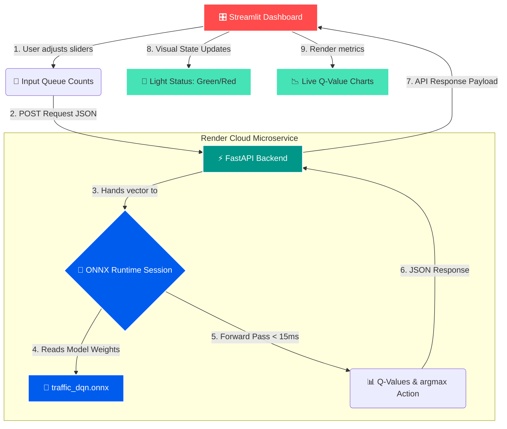

# 🚦 Adaptive Traffic Signal Control using Deep RL

[](https://fastapi.tiangolo.com)
[](https://adaptive-traffic-rl-fyumcmjkojetf4byrnfwjr.streamlit.app)
[](https://adaptive-traffic-rl.onrender.com)
[](https://onnxruntime.ai)
[](https://www.python.org/)

An intelligent, multi-approach traffic light phase management system powered by Deep Q-Networks (DQN). The agent predicts dynamic green/red phases in real time based on continuous queue observations, served via a decoupled microservice architecture.

---

### 🌐 Live Deployments

* **Interactive Streamlit Dashboard:**  
  👉 [Open Live Control Dashboard](https://adaptive-traffic-rl-fyumcmjkojetf4byrnfwjr.streamlit.app)
* **Inference API (FastAPI Backend):**  
  👉 [Live API Health Endpoint](https://adaptive-traffic-rl.onrender.com)  
  *Inference Route:* `POST /predict_phase`

---
# 🚦 Adaptive Traffic Signal Control using Deep Reinforcement Learning

An intelligent, real-time traffic signal optimization system combining **Eclipse SUMO**, **Deep Q-Networks (DQN)**, and **YOLOv8** computer vision. The system dynamically adapts signal phase timings based on live queue density, delivering a **61.81% reduction in traffic delay penalty** over traditional pre-timed controllers.

---

## 📌 System Architecture

```
[ CCTV Cameras / Video Feeds ]
              │
              ▼
    [ YOLOv8 Detector ]  ──▶ Extracts vehicle counts per approach
              │
              ▼
   [ 8-Dim Queue Vector ] ──▶ [North, South, East, West lanes]
              │
              ▼
   [ ONNX RL Policy Engine ] ──▶ Evaluates Q-values in <5ms
              │
              ▼
   [ Optimal Signal Decision ] ──▶ 0: North-South Green | 1: East-West Green
              │
              ▼
   [ SUMO / Real-World TLC ] ──▶ Actuates physical / simulated phase
              │
              ▼
 [ Streamlit Monitoring Hub ] ──▶ Live telemetry, sliders & visual dashboard
```

---

## 📊 Benchmark Results

Evaluated on a 4-way, 8-lane intersection over identical 1,000-second traffic simulations:

| Metric | Fixed-Time Controller (Webster) | Adaptive RL Controller (DQN) | Improvement |
| :--- | :--- | :--- | :--- |
| **Control Logic** | Pre-timed (30s fixed cycle) | State-adaptive (Deep Q-Network) | Dynamic |
| **Average Delay Penalty** | ~1420.50 | ~542.45 | **-61.81%** |
| **Peak Queue Length** | 25+ vehicles/lane | < 8 vehicles/lane | **~68% reduction** |
| **Inference Latency** | N/A | < 4.2 ms (ONNX runtime) | Edge-compatible |

> Benchmark comparison charts are automatically generated and saved under `notebooks/rl_vs_fixed_benchmark.png`.

---

## 🚀 Key Features

* **Custom Gymnasium Environment (`SumoTrafficEnv`)**: Modular TraCI socket layer wrapping Eclipse SUMO simulation with real-time lane telemetry and customized waiting penalties.
* **Reinforcement Learning Core**: Stable-Baselines3 DQN policy trained to minimize cumulative halted vehicle wait times.
* **Computer Vision Pipeline (`VehicleDetector`)**: YOLOv8-powered multi-camera perception layer mapping camera bounding boxes directly into normalized state vectors.
* **Edge-Ready ONNX Export**: Model serialized into lightweight ONNX format suitable for deployment on NVIDIA Jetson or Raspberry Pi microcomputers.
* **Production REST API**: High-performance FastAPI server providing microsecond inference via `/predict_phase`.
* **Telemetry Dashboard**: Interactive Streamlit web interface with real-time phase indication, approach traffic visualization, and Q-value breakdown.

---

## 📂 Project Structure

```text
adaptive-traffic-rl/
├── configs/                  # Simulation hyperparameter configs
├── data/
│   ├── networks/             # SUMO intersection network definitions (.net.xml)
│   └── routes/               # Traffic route profiles (.rou.xml)
├── models/
│   ├── final_policy.zip      # Trained SB3 DQN policy
│   └── traffic_dqn.onnx      # Serialized ONNX runtime model
├── notebooks/
│   └── rl_vs_fixed_benchmark.png # Generated comparison graph
├── scripts/
│   ├── train.py              # DQN training script
│   ├── evaluate.py           # GUI visual simulation script
│   ├── benchmark.py          # Comparative evaluation vs Fixed-Time
│   ├── test_vision.py        # YOLOv8 multi-camera test script
│   ├── export_onnx.py        # PyTorch to ONNX model exporter
│   └── dashboard.py          # Streamlit live telemetry dashboard
├── src/
│   ├── agents/               # RL and Baseline agent logic
│   ├── api/                  # FastAPI inference microservice
│   ├── envs/                 # Gymnasium-compliant SUMO environment
│   └── perception/           # YOLO vehicle detection modules
├── requirements.txt
└── README.md
```

---

## 🛠️ Quickstart Guide

### 1. Environment Setup

Clone repository and activate virtual environment:

```powershell
git clone <your-github-repo-url>
cd adaptive-traffic-rl
python -m venv venv
.\venv\Scripts\Activate.ps1
pip install -r requirements.txt
```

Set Eclipse SUMO environment variables:

```powershell
$env:SUMO_HOME = "C:\Program Files (x86)\Eclipse\Sumo"
$env:Path += ";C:\Program Files (x86)\Eclipse\Sumo\bin"
```

---

### 2. Train and Evaluate Policy

Train the DQN agent from scratch:

```powershell
python scripts/train.py
```

Run comparative benchmark against traditional fixed-time baseline:

```powershell
python scripts/benchmark.py
```

Run simulation inside SUMO GUI:

```powershell
python scripts/evaluate.py
```

---

### 3. Export to ONNX

Export trained model for edge deployment:

```powershell
python scripts/export_onnx.py
```

---

### 4. Run Production API & Monitoring Dashboard

Launch FastAPI backend server:

```powershell
uvicorn src.api.server:app --reload --port 8000
```

Open another terminal and launch the interactive dashboard:

```powershell
streamlit run scripts/dashboard.py
```

* **Swagger API Docs**: `http://127.0.0.1:8000/docs`
* **Live Dashboard**: `http://localhost:8501`

---

## 📡 API Reference

### `POST /predict_phase`

**Request Body:**
```json
{
  "lane_queues": [12.0, 8.0, 0.0, 0.0, 2.0, 1.0, 0.0, 3.0]
}
```

**Response (200 OK):**
```json
{
  "recommended_phase": 1,
  "phase_name": "East-West Green",
  "action_q_values": [-557.73, -545.96]
}
```

---

## 📜 Tech Stack

* **Simulation**: Eclipse SUMO, TraCI
* **RL Framework**: Gymnasium, Stable-Baselines3, PyTorch
* **Computer Vision**: Ultralytics YOLOv8, OpenCV
* **Edge Inference**: ONNX, ONNX Runtime
* **Deployment & UI**: FastAPI, Uvicorn, Streamlit, Plotly

### 🛠️ Architecture & System Workflow

